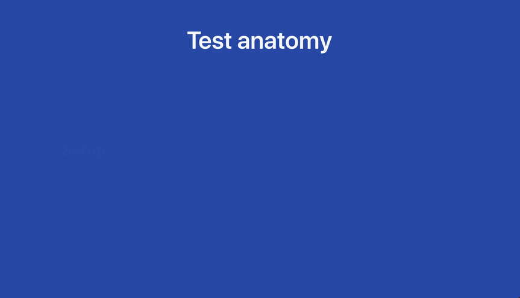
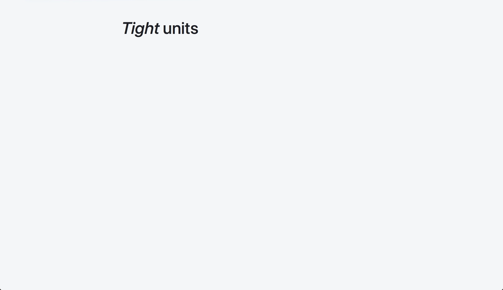

# react-testing-talk

Slides and resources for my React testing talk

## Links

- [Browse test examples](examples)
- [Browse presentation code](pres)
- [Kent Beck quote source](https://twitter.com/kentbeck/status/938461525626437632)
- [Martin Fowler quote source](https://martinfowler.com/bliki/UnitTest.html)

